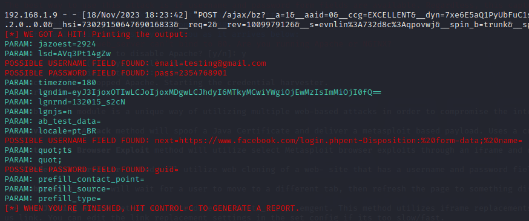

# Information-Security
# Ataque Phishing para capturar login de usuário

### Ferramentas utilizadas

- Kali  Linux
- Setoolkit

### Técnica

- Acesso: sudo setoolkit
- Tipo de ataque: Social-Enginnering Attacks
- Método de ataque: Website Attack Vectores
- Método de ataque 2: Credential Harvester Attack Method
- Ataque: Site Cloner
- Alvo: https://www.facebook.com
## Tela de captura

